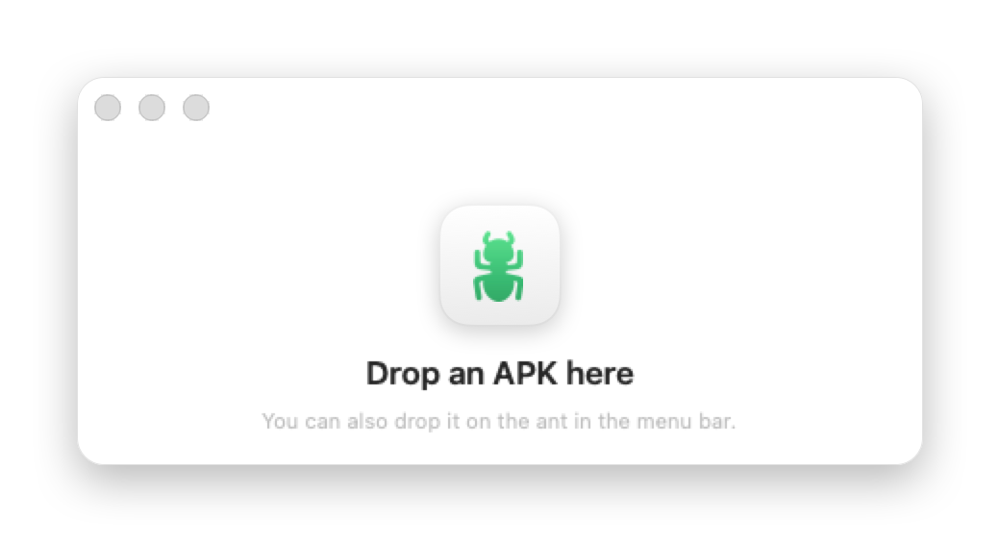

# Quick ADB

<p align="center">
  
</p>

A tiny macOS menu bar app to push APKs to an Android phone. Drop an APK on the ant, it lands on the phone and opens.


## Features

- **Drag and drop an APK** on the 🐜 in the menu bar, or on the Quick ADB window.
- **Reads the package name from the APK**, so it works with any app, nothing hardcoded.
- **Replaces the app in place** (`adb install -r`), so its data and home screen icon are kept. If that fails (e.g. a different signing key), it falls back to uninstall + install.
- **Launches the app** once installed.
- **Every connected device** gets the APK.
- **No device?** The window asks you to connect one and keeps the APK; hit **Push to device** when it's plugged in.
- **Capture log**: saves the last 1, 2, 3, 4, 5, 10, 15 or 30 minutes of `logcat` to the Desktop.
- **Take screenshot**: saves the phone screen as a PNG on the Desktop.
- Devices show by name (e.g. *Google Pixel 8a*), not by serial.


## Menu

| Item | What it does |
|---|---|
| Install APK… | Pick an APK from a file dialog |
| Show window | Reopen the window with the last result |
| Capture log → *Last N min* | `adb logcat -d -t <since>` → `~/Desktop/<device>-<date>.log` |
| Take screenshot → *device* | `adb exec-out screencap -p` → `~/Desktop/<device>-<date>.png` |
| Launch at login | Start Quick ADB when you log in (checkmark when on) |
| Quit | |

## Requirements

- macOS 14+
- `adb` (Homebrew `android-platform-tools`, or the Android SDK `platform-tools`)
- `aapt2` from the Android SDK `build-tools` (or `apkanalyzer`) to read the package name
- USB debugging enabled on the phone

Tools are looked up in `/opt/homebrew/bin`, `/usr/local/bin`, `$ANDROID_HOME` and `~/Library/Android/sdk`.

## Install

```sh
./build.sh install   # build, copy to /Applications, launch
```

Then open it from Spotlight (⌘Space → *Quick ADB*). Opening it again while it runs shows the window.

To share it, `./build.sh dmg` makes `QuickADB.dmg`: open it and drag Quick ADB onto Applications. The app is ad-hoc signed, so on another Mac right-click → **Open** the first time.

**Launch at login**: toggle it from the menu.

## Build From Source

```sh
./build.sh           # QuickADB.app in this folder
open QuickADB.app
```

`build.sh` compiles `main.swift` with `swiftc` and wraps it in an ad-hoc signed app. No Xcode project needed. The icon is generated by `swift tools/make-icon.swift` into `resources/AppIcon.icns`.

## Notes

- Installs use `--install-reason 4` (user request), so the Pixel launcher can add a home screen icon on a fresh install when *Add app icons to Home screen* is on.
- Log time ranges use the Mac's clock, like `adb logcat -t`.
- The first log or screenshot may trigger a macOS prompt to allow access to the Desktop.
